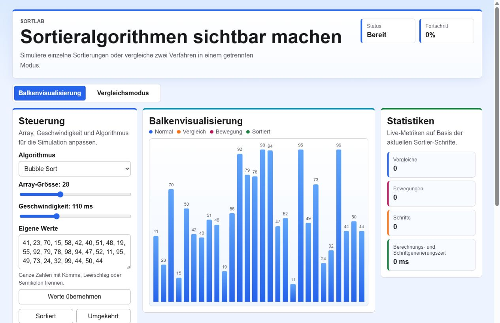

# SortLab

**Deutsch** | [English](./README_EN.md)

SortLab ist ein interaktiver React-Visualizer für Sortieralgorithmen. Das Projekt zeigt, wie Arrays schrittweise sortiert werden, und macht Vergleiche, Bewegungen, Animationsschritte und die Berechnungs- und Schrittgenerierungszeit sichtbar.

## Projektstatus

Aktueller Stand: **Stabile Portfolio-Version**

Diese Version ist als ergänzendes Portfolio-Projekt gedacht. Tests und Produktions-Build wurden lokal erfolgreich ausgeführt.

## Hauptfunktionen

- Balkenvisualisierung für Sortierabläufe
- getrennte Tabs für Visualisierung und Vergleichsmodus
- zufällige Arrays mit einstellbarer Grösse
- eigene Array-Eingabe mit Validierung für ganze Zahlen
- Presets für sortierte, umgekehrte und negative Werte
- steuerbare Animationsgeschwindigkeit
- farbliche Markierung von Vergleichen, Bewegungen und sortierten Werten
- Vergleichsmodus mit zwei unabhängig wählbaren Algorithmen und eigener Array-Grösse
- Statistik für Vergleiche, Bewegungen, Animationsschritte und Berechnungs- und Schrittgenerierungszeit

## Algorithmen

- Bubble Sort
- Selection Sort
- Insertion Sort
- Quick Sort
- Heap Sort

## Vergleiche Und Bewegungen

`Vergleiche` zählt, wie oft ein Algorithmus Werte miteinander vergleicht.

`Bewegungen` zählt arrayverändernde Operationen. Bei Bubble Sort, Selection Sort, Quick Sort und Heap Sort sind das echte Vertauschungen. Bei Insertion Sort sind es Verschiebungen und das Einfügen eines Werts an einer neuen Position. Darum heisst die Kennzahl bewusst nicht `Swaps`.

## Zeitmessung

Die angezeigte Zeit heisst **Berechnungs- und Schrittgenerierungszeit**. Sie umfasst die Berechnung der Sortierung und das Erzeugen der Animationsschritte für die Visualisierung. Die Werte sind keine wissenschaftlichen Benchmarks und hängen vom Browser, Gerät und aktuellen Systemzustand ab.

## Tech-Stack

- React 18
- Vite 5
- JavaScript
- CSS
- Vitest
- GitHub Actions

## Installation

```bash
git clone https://github.com/AleksZyro/SortLab.git
cd SortLab
npm ci
```

## Entwicklungsstart

```bash
npm run dev
```

## Tests

```bash
npm test
```

Lokal ausgeführt:

- `npm ci`: erfolgreich
- `npm test`: erfolgreich, 42 Tests bestanden

Getestet werden alle vorhandenen Sortieralgorithmen mit leerem Array, einem Element, bereits sortierten Werten, umgekehrt sortierten Werten, doppelten Werten, negativen Werten, korrekter aufsteigender Sortierung sowie plausibler Zählung von Vergleichen und Bewegungen.

## Produktions-Build

```bash
npm run build
```

Lokal ausgeführt:

- `npm run build`: erfolgreich, Vite-Build erstellt

## Deployment

GitHub Pages ist über `.github/workflows/deploy-pages.yml` vorbereitet. Der Workflow baut mit dem Basispfad `/SortLab/`, lädt `dist` als Pages-Artefakt hoch und deployt zu GitHub Pages.

Live-Demo:

[https://alekszyro.github.io/SortLab/](https://alekszyro.github.io/SortLab/)

Falls das Deployment später nicht läuft, sollte in GitHub geprüft werden:

`Settings → Pages → Build and deployment → Source → GitHub Actions`

## Projektstruktur

```text
SortLab/
|- .github/
|  `- workflows/
|     |- ci.yml
|     `- deploy-pages.yml
|- docs/
|  `- assets/
|     `- sortlab-demo.png
|- src/
|  |- App.jsx
|  |- main.jsx
|  |- styles.css
|  `- utils/
|     |- arrayInput.js
|     |- arrayInput.test.js
|     |- sortAlgorithms.js
|     `- sortAlgorithms.test.js
|- index.html
|- package-lock.json
|- package.json
|- README.md
`- README_EN.md
```

## Technische Entscheidungen

- Die Sortierfunktionen erzeugen Zustände für die Animation, damit die UI jeden Schritt darstellen kann.
- Die Statistik verwendet `Bewegungen`, weil nicht jeder Algorithmus nur echte Swaps nutzt.
- Die Zeitmessung wird nicht als reine Algorithmuslaufzeit dargestellt.
- Die Tests prüfen die Algorithmuslogik unabhängig von der React-Oberfläche.
- GitHub Actions nutzt Node.js 22 und `npm ci`.

## Bekannte Einschränkungen

- Der Vergleichsmodus zeigt Statistikwerte, animiert aber nicht beide Algorithmen parallel.
- Die Zeitmessung ist abhängig von Browser und Gerät.
- Es gibt keine automatisierten UI-Tests.
- GitHub Pages ist vorbereitet, aber die Repository-Einstellung muss manuell auf GitHub Actions gesetzt werden.

## Screenshot

Der Screenshot wurde aus der gebauten Anwendung nach erfolgreichem `npm ci`, `npm test` und `npm run build` erzeugt.



## Demo-Video

Im Repository ist aktuell kein Demo-Video oder GIF enthalten. Falls später ein kurzes Demo ergänzt wird, sollte es 10 bis 20 Sekunden dauern und klein genug bleiben, damit das Repository nicht unnötig gross wird.

## Lizenzstatus

Dieses Projekt ist unter der MIT-Lizenz veröffentlicht. Details stehen in [LICENSE](./LICENSE).

## Repository-Metadaten Vorschlag

- Description: `Interactive React visualizer for comparing sorting algorithms and their operations.`
- Website: `https://alekszyro.github.io/SortLab/`

## Benutzeranleitung

Eine einfache Anleitung für Personen ohne Informatik-Vorwissen findest du hier:

[Benutzeranleitung für Anfänger](BENUTZERANLEITUNG.md)
